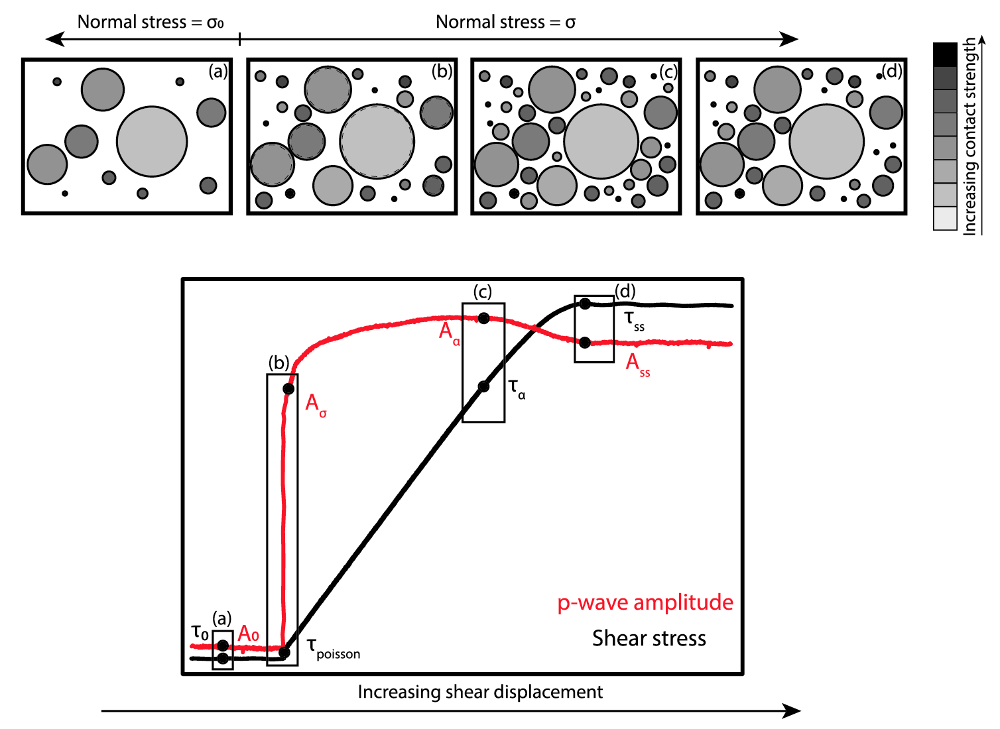
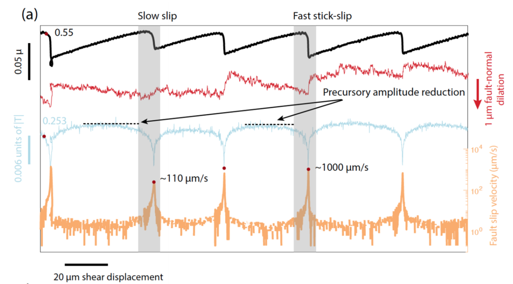
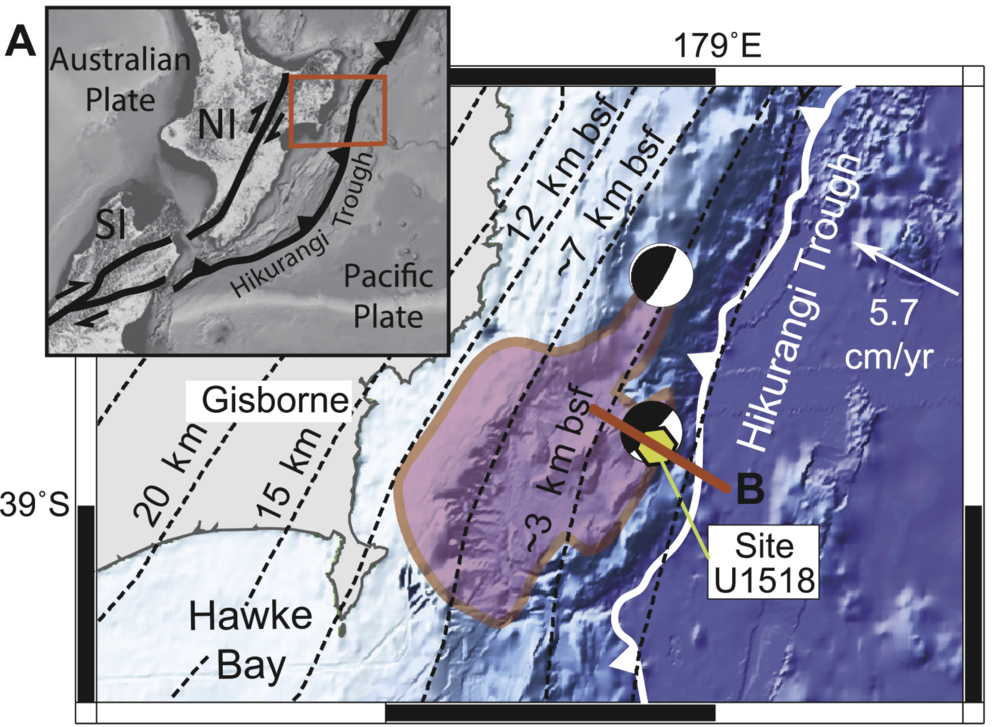

## Micromechanics of frictional sliding
Fault frictional stability is usually described in the context of slip weakening or rate-state friction which do not fully describe the range of observations documented in nature and in the laboratory. Moreover, these description do not fully capture the complex behaviors at the nano- to microscope asperity scale elastic and plastic deformations. I perform continuous ultrasonic monitoring and study the temporal evolution of elastic wave amplitudes and velocities to better understand the microscopic origins of fault friction. This is particularly important for better understanding the physics of static and dynamic triggering, rupture nucleation and propagation, and aseismic creep and slow slip.

Recent works include [Shreedharan et. al. (2019)][https://agupubs.onlinelibrary.wiley.com/doi/full/10.1029/2018JB016885].

## Earthquake precursors and prediction
Earthquake prediction has been a longstanding problem in seismology. Many initiatives in the past four decades have searched for robust precursory signatures to inform us about imminent earthquakes. I study the amplitudes and velocities of active ultrasonic pulses as well as passive acoustic emission signatures to quantify precursory behaviors prior to slow and fast laboratory earthquakes. I am particularly interested in the physical mechanisms responsible for these precursors, and the scaling relationships that govern the size and temporal onset of seismic precursors. More recently, I have also started exploring the feasibility of incorporating machine learning techniques to predict fault failure, using these active and passive precursory signatures.

## Friction and hydrology of shallow slow slip
While slow earthquakes, both shallow and deep, are now well documented, the frictional and hydrologic behavior of the rocks and sediments participating in slow earthquake rupture are not well constrained. It is particularly important to study these shallow slow earthquakes since they have been shown to alter the local stress state, which has implications for the nucleation of tsunamigenic earthquakes. I study the frictional stability and permeability evolution of sediments from the northern Hikurangi margin, recovered during [IODP expedition 375][http://publications.iodp.org/proceedings/372B_375/372B375title.html], to understand the key ingerdients necessary to host shallow slow slip. I am also interested in quantifying the effects of seamount subduction on modulating the slip behavior of this subduction margin. 

